# Launching instance, obtaining DNS and installing, apache2/wordpress/SSL

## Configuring EC2 instance
### Step 1:
Create the name of your new instance.
Following this, select Ubuntu, there are a range of useable tiers, each with their own specirfications and prices
(as shown when selecting tiers).
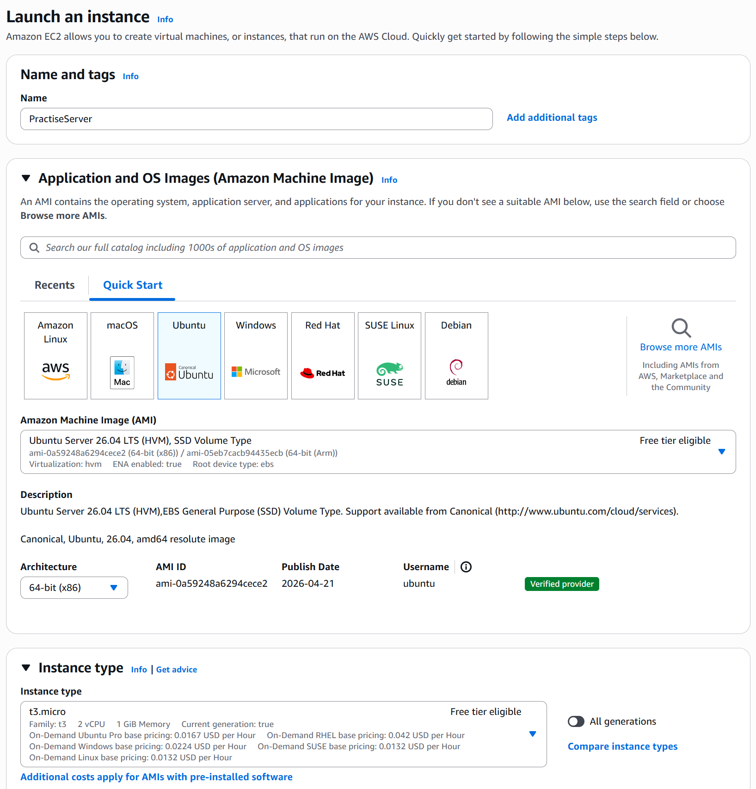
 
### Step 2: 
Create a key pair login. This is used to access your instance, securely. Save the key pair in a location it will not be lost as you will it.
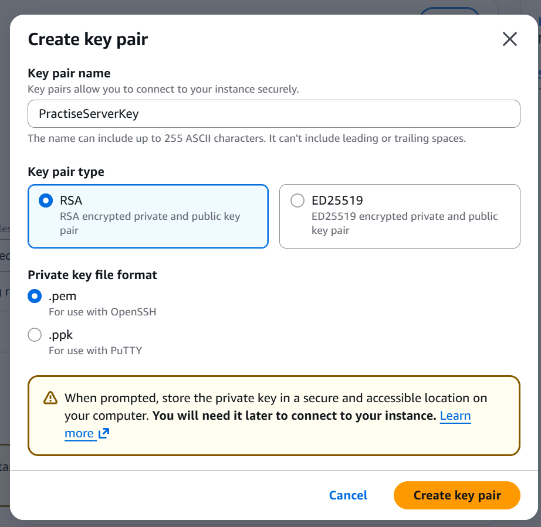

### Step 3:
Create a security group, tick the boxes for allowing http and https traffic.
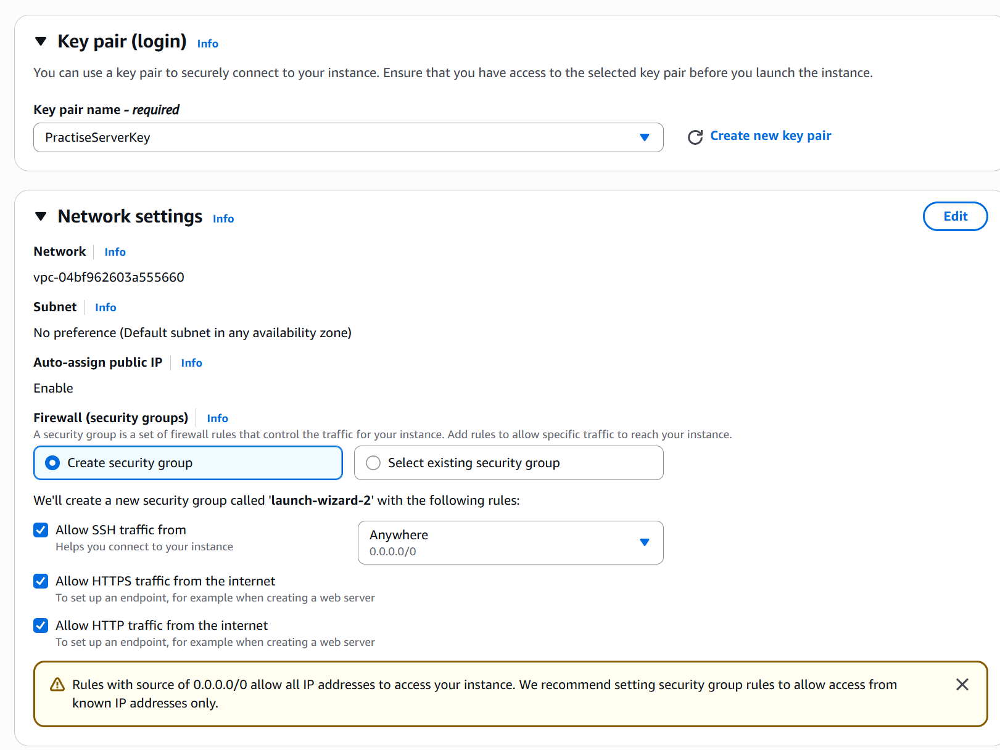

### Step 4:
Select to launch instance.

## Elastic IP 
### Step 1:
Enter your instance. On the left side panel, select Elastic IP.
On the top right of the new page, select to allocate IP address.
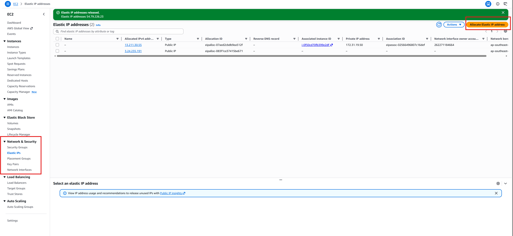

### Step 2:
Select the Elastic IP that you wish to associate with your created instance.
Then click on actions, top right, followed by associate Elastic IP.
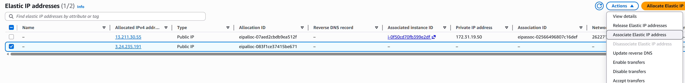

### Step 3:
Select the instance tha tyou wish to associate your Elastic IP to.
Reload browser to check that the IP has been associated correctly.
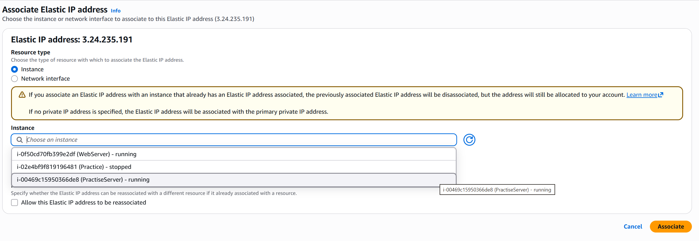

## Connect to your instance
### Step 1:
Go back to your instances. Select an instance and click on connect up the top of your screen.
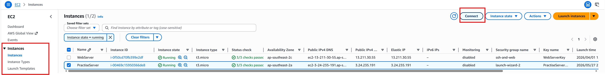

### Step 2:
In powershell/terminal. Use cd to go to the directory that your key pair is located.
or for convinience type cd then drag the folder the keypair is located in, into powershell/terminal.
Then Copy the text below and paste into powershell/terminal.
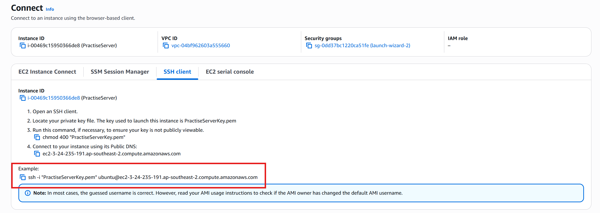

## Installing apache2
Running the commands below, will install Apache2 on your web server.
To check that it is installed, you can copy your ip address into a browser, which should bring up the apache2 default page.

```sudo apt update
sudo apt upgrade
sudo apt install apache2```
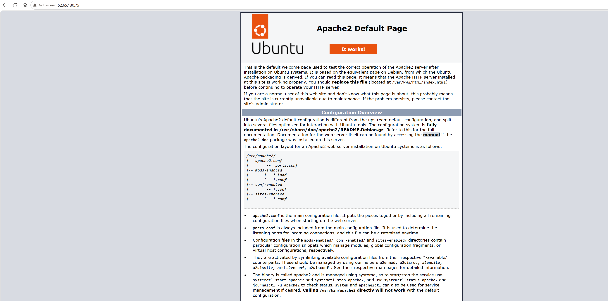

##Obtaining a DNS
There are a variety of platforms offering the services needed to obtain a DNS. 
For this example, NameCheap, was used.
After creating an account, and obtaining a dns, go to advanced DNS.
Enter your ip in the required column, this will link your new dns to your ip address.
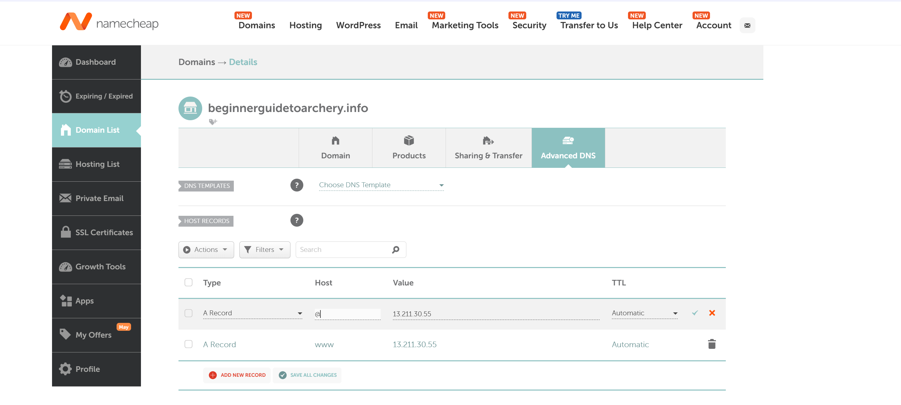

##Installing PHP, MySQL and WordPress
Installing PHP and MySQL is necessary, as wordpress requires them installed, in order to function.
Using sudo will enables you to have administrative access. Enabling you to perform the necessary steps below.

### Step 1:
Installing PHP and connecting PHP to apache and MySQL

```sudo apt install php libapache2-mod-php php-mysql```
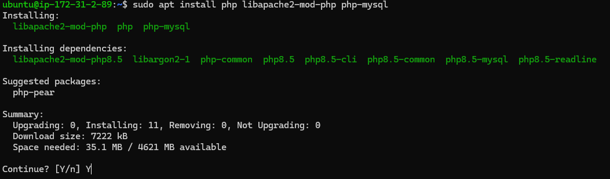

### Step 2:
Install MySQL.

```sudo apt install mysql-server```
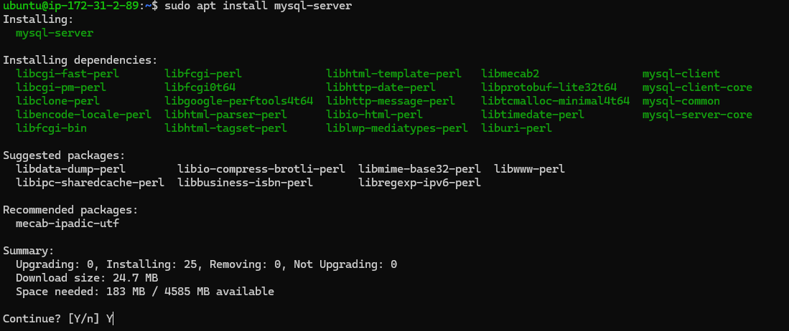

### Step 3:
Log in to MySQL, as root(admin) user.

```sudo mysql -u root```
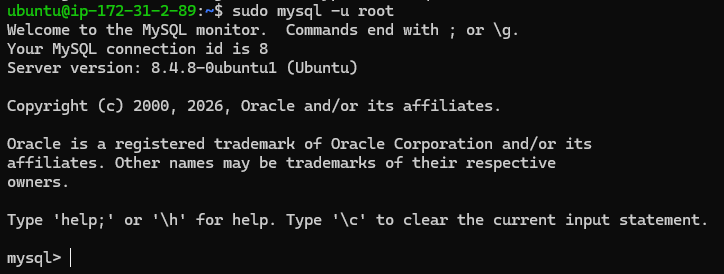

### Step 4:
The following command will change access to root user, to now require a password.
Make sure to select your own password, in place of the word 'password' below.

```ALTER USER 'root'@'localhost' IDENTIFIED BY 'Password';```

To create a new user, use the same command as before, but instead of teh word "Alter: user, we use "create" user.

```CREATE USER 'wp_user'@localhost IDENTIFIED BY 'Password';```

Create a new user, as this is the user/password you will use for wordpress.

### Step 5:
Create a new database, this is where wordpress will store its data.
This example creates a database, named wordpress, however you can use any name of choice.

```CREATE DATABASE wordpress;```

### Step 6:
Grant priveleges to the user that you created earlier, to read, write and modify, in the database just created.

### Step 6:
Exit MySQL, back to your ubuntu server by typing exit.
Download the latest version of Wordpress using the following command/link.

```cd /tmp
wget https://wordpress.org/latest.tar.gz```

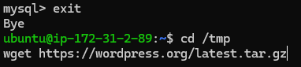

### Step 7:
Extract wordpress.

```tar -xvf latest.tar.gz```

### Step 8:
Move the extracted directory, into /var/www/html This is the default document root for apache and will now enable you to access wordpress via your servers IP address.

```sudo mv wordpress/ /var/www/html```
```cd /var/www/html/```
```cd wordpress/```
```nano wp-config.php```
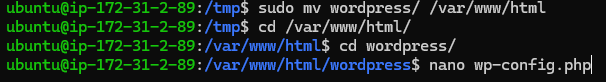

### Step 9:
Copy your IP address into your web browser, followed by /wordpress. ie, ipaddress/wordpress.
This should show the followiung screenshot.
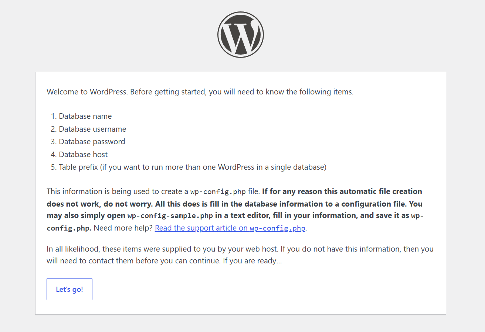

Fill in the details in the following table, the details will be the same as what you used in thecreation of your database.
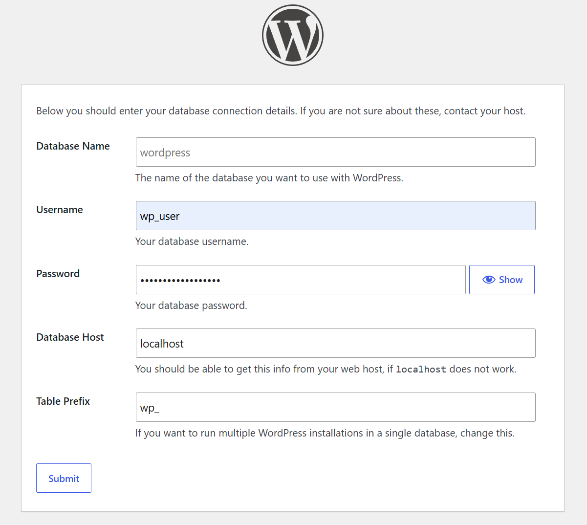

The following page will open, copy the text.
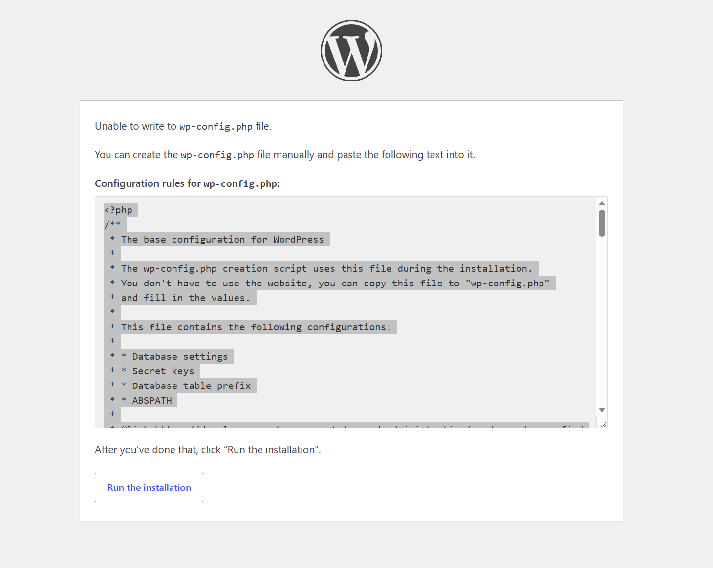

Come back to powershell/terminal, and paste the copied text.
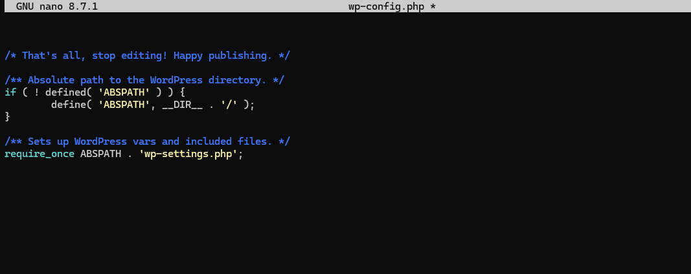

press ctrl + x, press y to save, then press enter.

Go back to your browser, now click to run the installation. You should now have the following page visible.
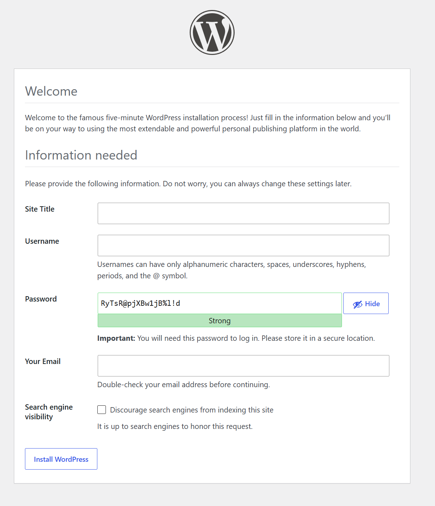
Fill out the details and you will now have installed wordpress.

Restartm apache.
```sudo systemctl restart apache2```

## Linking your DNS
Before completing this step, make sure that you have checked that your DNS has linked to your IP address correctly, and that it is working.
in wordpress, on the left hand side, go to Swttings, general. You can now see 2 address inputs. Change them both to match your DNS.
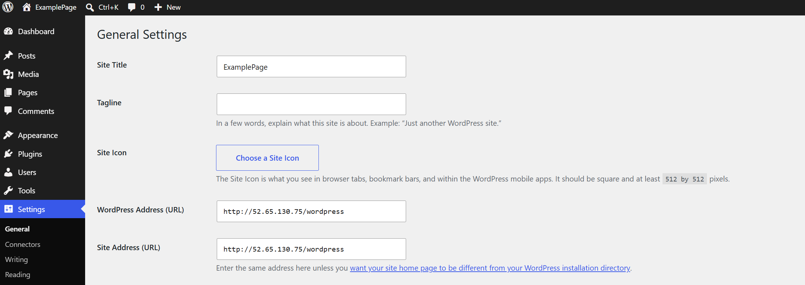

## Obtaining SSL certificate
### Step 1:
Install certbot. A free tool that automatically gets a free SSL certificate from Lets Encrypt
```sudo apt-get update```
```sudo apt install certbot python3-certbot-apache```
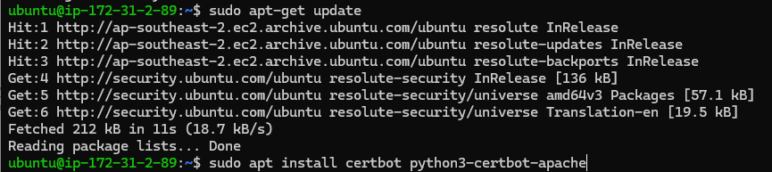

Then run the command. Certbot will then detect your domain and ask which domain to secure.
```sudo certbot --apache```